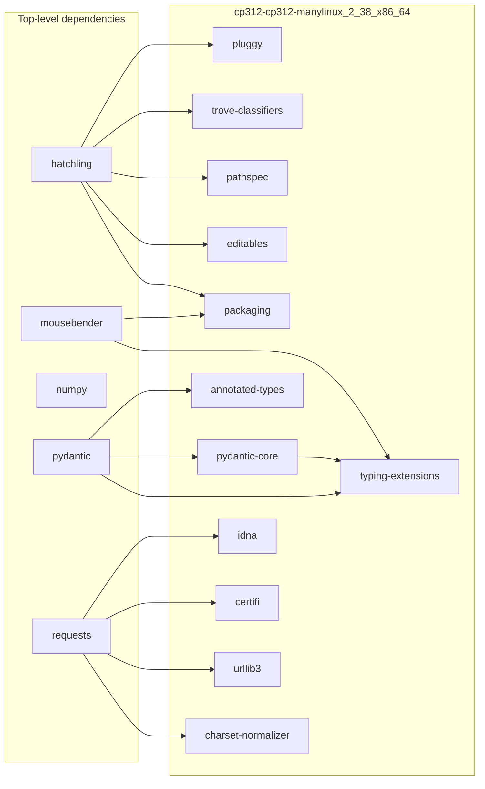

```mermaid
graph LR
  subgraph top [Top-level dependencies]
    hatchling
    mousebender
    numpy
    pydantic
    requests
  end
  subgraph cp312-cp312-manylinux_2_38_x86_64
    annotated-types
    certifi
    charset-normalizer
    editables
    hatchling
    packaging
    pathspec
    pluggy
    trove-classifiers
    idna
    mousebender
    typing-extensions
    numpy
    pydantic
    pydantic-core
    requests
    urllib3
    hatchling --> pluggy
    hatchling --> trove-classifiers
    hatchling --> pathspec
    hatchling --> editables
    hatchling --> packaging
    mousebender --> packaging
    mousebender --> typing-extensions
    pydantic --> annotated-types
    pydantic --> pydantic-core
    pydantic --> typing-extensions
    pydantic-core --> typing-extensions
    requests --> idna
    requests --> certifi
    requests --> urllib3
    requests --> charset-normalizer
  end
```
